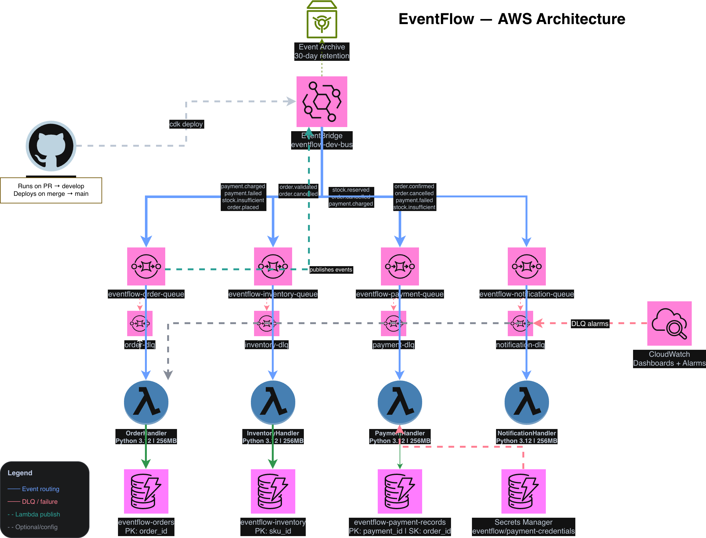

# EventFlow

[](https://github.com/jeffgrahamcodes/eventflow/actions/workflows/ci.yml)

A production-grade, event-driven order processing platform built on AWS
serverless — and a developer platform layered on top of it.

EventFlow demonstrates event-driven architecture using Python, Pydantic v2,
and AWS (EventBridge, SQS, Lambda, DynamoDB). It is designed as a reference
implementation and Staff+ portfolio artifact, not a tutorial project.

## Architecture



- [Event Flow Diagram](docs/diagrams/event-flow.md) — system topology
- [Sequence Diagram](docs/diagrams/sequence-diagram.md) — temporal event ordering
- [ADR-001](docs/adr/ADR-001-event-schema-design.md) — Event schema design decisions
- [ADR-002](docs/adr/ADR-002-aws-service-selection.md) — AWS service selection rationale

## How It Works

EventFlow implements **event choreography** — no central orchestrator. Each
service reacts to events and emits new ones. The full happy path:

```
OrderPlaced → OrderValidated → StockReserved → PaymentCharged → OrderConfirmed → CustomerNotified
```

Failure paths are handled automatically through the same choreography:

```
PaymentFailed  → OrderCancelled → StockReleased → CustomerNotified
StockInsufficient → OrderCancelled → CustomerNotified
```

Four services. Ten EventBridge routing rules. One in-memory bus in Python,
one real bus in AWS. The behavior is identical in both environments.

## Getting Started

### Prerequisites

- Python 3.12+
- Node.js 20+ (for AWS CDK)
- [uv](https://docs.astral.sh/uv/getting-started/installation/)
- AWS CLI configured (for deployment)
- Docker (for CDK Lambda bundling)

### Installation

```bash
git clone git@github.com:jeffgrahamcodes/eventflow.git
cd eventflow
uv sync --extra dev
```

### Run the tests

```bash
uv run pytest
```

### Run linting and type checking

```bash
uv run ruff check .
uv run mypy src/
```

### Deploy to AWS

```bash
cd infra
npm ci
npx cdk bootstrap   # once per AWS account/region
npx cdk deploy
```

### Smoke test against deployed stack

```bash
uv run python scripts/smoke_test.py
```

## Project Structure

```
eventflow/
├── src/eventflow/
│   ├── events/           # Pydantic v2 event models (9 event types)
│   ├── services/         # OrderService, InventoryService, PaymentService, NotificationService
│   └── handlers/         # Lambda handlers — AWS adapter layer
├── tests/                # 49 tests, mirrors src/ structure
├── infra/
│   ├── lib/              # CDK stack — EventBridge, SQS, Lambda, DynamoDB
│   └── lambda/           # (deprecated — handlers moved to src/eventflow/handlers/)
├── scripts/
│   └── smoke_test.py     # End-to-end validation against real AWS
├── docs/
│   ├── adr/              # ADR-001, ADR-002
│   └── diagrams/         # Architecture and sequence diagrams
└── pyproject.toml
```

## Architecture Decisions

| ADR | Title | Status |
| --- | ----- | ------ |
| [ADR-001](docs/adr/ADR-001-event-schema-design.md) | Event Schema Design | Accepted |
| [ADR-002](docs/adr/ADR-002-aws-service-selection.md) | AWS Service Selection | Accepted |

## Tech Stack

| Layer | Technology |
| ----- | ---------- |
| Language | Python 3.12 |
| Event schemas | Pydantic v2 |
| Package manager | uv |
| Linter / formatter | ruff |
| Type checker | mypy |
| Testing | pytest + coverage |
| Cloud | AWS (EventBridge, SQS, Lambda, DynamoDB, Secrets Manager, CloudWatch) |
| IaC | AWS CDK (TypeScript) |
| CI/CD | GitHub Actions |

## Build Status

Phase 1 (Sprints 1–2) — Python service layer complete. 49 tests, 100% coverage on service and event layers.

Phase 2 (Sprints 3–4) — AWS infrastructure complete. Smoke test passing end-to-end in real AWS.

Phase 3 (Sprints 5–6) — Developer platform layer. `ef` CLI in progress.