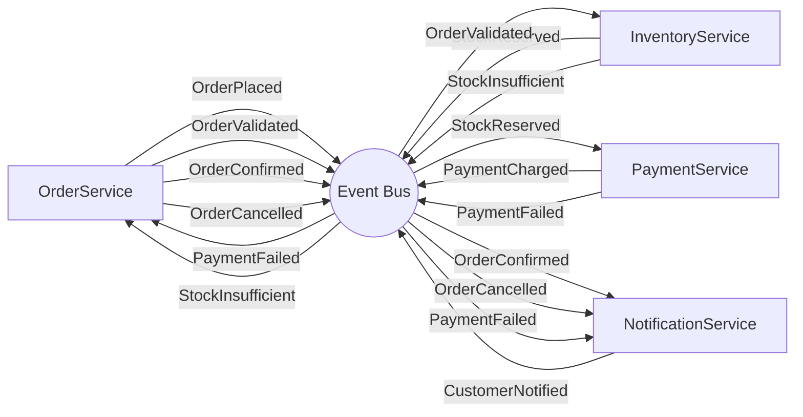

```mermaid
flowchart LR
    OS[OrderService] -->|OrderPlaced| EB((Event Bus))
    OS -->|OrderValidated| EB
    OS -->|OrderConfirmed| EB
    OS -->|OrderCancelled| EB
    IS[InventoryService] -->|StockReserved| EB
    IS -->|StockInsufficient| EB
    PS[PaymentService] -->|PaymentCharged| EB
    PS -->|PaymentFailed| EB
    NS[NotificationService] -->|CustomerNotified| EB

    EB -->|OrderValidated| IS
    EB -->|StockReserved| PS
    EB -->|OrderConfirmed| NS
    EB -->|OrderCancelled| NS
    EB -->|PaymentFailed| NS
    EB -->|PaymentFailed| OS
    EB -->|StockInsufficient| OS
```