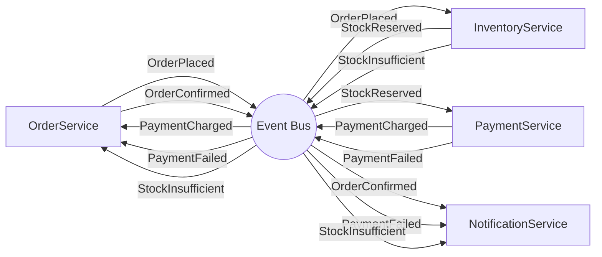

```mermaid
flowchart LR
    OS[OrderService] -->|OrderPlaced| EB((Event Bus))
    EB -->|OrderPlaced| IS[InventoryService]
    IS -->|StockReserved| EB
    EB -->|StockReserved| PS[PaymentService]
    PS -->|PaymentCharged| EB
    EB -->|PaymentCharged| OS
    OS -->|OrderConfirmed| EB
    EB -->|OrderConfirmed| NS[NotificationService]
    PS -->|PaymentFailed| EB
    EB -->|PaymentFailed| OS
    EB -->|PaymentFailed| NS
    IS -->|StockInsufficient| EB
    EB -->|StockInsufficient| OS
    EB -->|StockInsufficient| NS
```