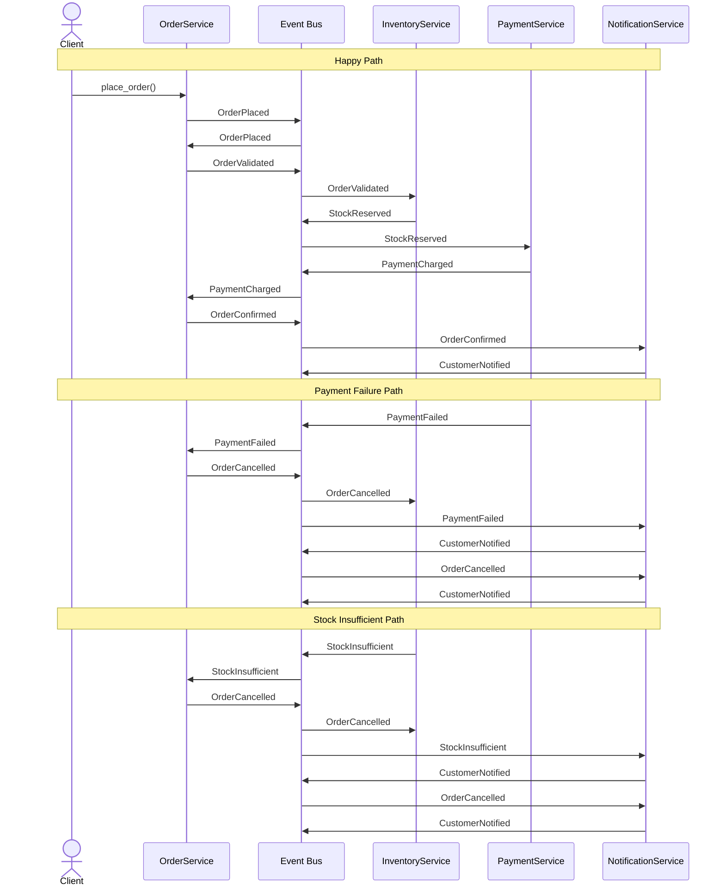

# EventFlow Sequence Diagram

```mermaid
sequenceDiagram
    actor Client
    participant OS as OrderService
    participant Bus as Event Bus
    participant IS as InventoryService
    participant PS as PaymentService
    participant NS as NotificationService

    note over Client,NS: Happy Path
    Client->>OS: place_order()
    OS->>Bus: OrderPlaced
    Bus->>OS: OrderPlaced
    OS->>Bus: OrderValidated
    Bus->>IS: OrderValidated
    IS->>Bus: StockReserved
    Bus->>PS: StockReserved
    PS->>Bus: PaymentCharged
    Bus->>OS: PaymentCharged
    OS->>Bus: OrderConfirmed
    Bus->>NS: OrderConfirmed
    NS->>Bus: CustomerNotified

    note over Client,NS: Payment Failure Path
    PS->>Bus: PaymentFailed
    Bus->>OS: PaymentFailed
    OS->>Bus: OrderCancelled
    Bus->>IS: OrderCancelled
    Bus->>NS: PaymentFailed
    NS->>Bus: CustomerNotified
    Bus->>NS: OrderCancelled
    NS->>Bus: CustomerNotified

    note over Client,NS: Stock Insufficient Path
    IS->>Bus: StockInsufficient
    Bus->>OS: StockInsufficient
    OS->>Bus: OrderCancelled
    Bus->>IS: OrderCancelled
    Bus->>NS: StockInsufficient
    NS->>Bus: CustomerNotified
    Bus->>NS: OrderCancelled
    NS->>Bus: CustomerNotified
```